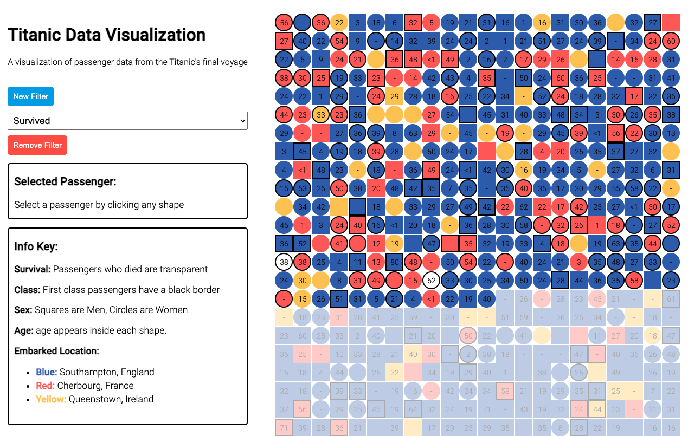

# Titanic Data Visualization
A visualization of passenger data from the Titanic's final voyage.

## Why?
* This project was built as an assignment for ACS 4310.
* The Titanic tragedy is a fascinating story that has created many questions and curiosities.

## Features: 
* Filter data to find interesting trends
  * Stack multiple filters at once.
* Find a new story.
  * Read the patterns of the data and find unheard stories of the titanic's passengers.
* Passenger Viewer
  * Select individual passengers and view their info.

## Live Url:
  * [Check it out!](http://www.jonathanewarner.com/TitanicDataVisualization/)

## Screenshots
